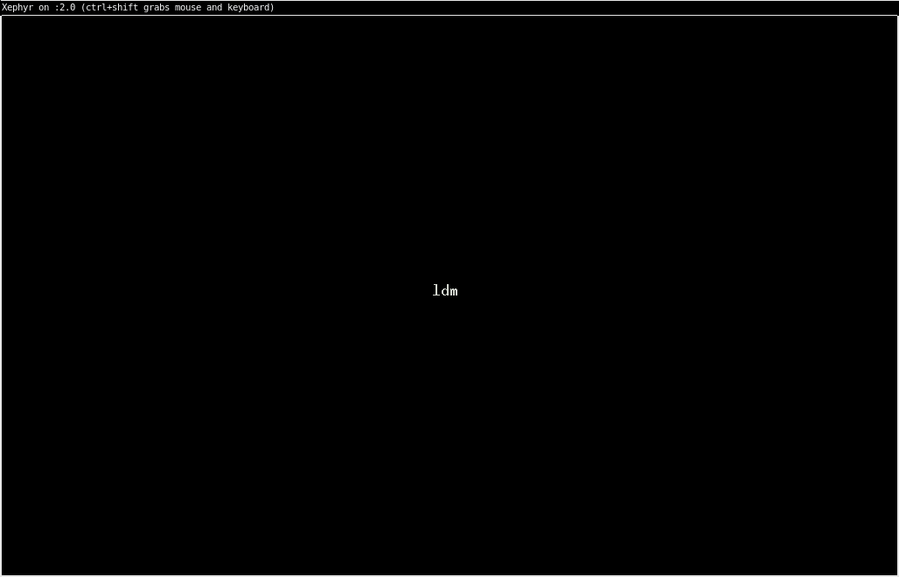
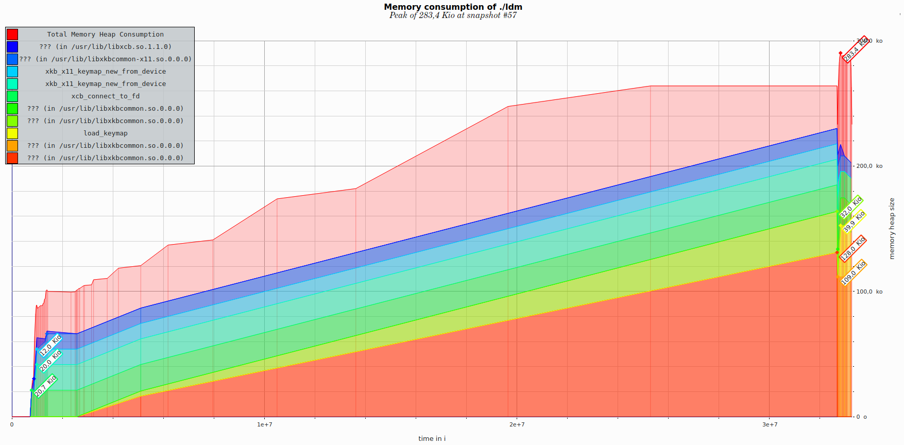

# ldm - Lean Display Manager

Trying to get comfy with x11, xcb, xkbcommon, pam.

ldm starts an X server, open a pam session, source user's xinitrc, waits, closes pam session.

User selection (left/right arrow selection) :

Border color is added when typing/erasing and on pam success/failure

## Lean

Using valgrind's massif tool and massif-visualizer.

*  http://0pointer.de/blog/projects/serial-console.html
*  https://standards.freedesktop.org/desktop-entry-spec/latest/
*  https://github.com/sddm/sddm/
*  https://wiki.archlinux.org/index.php/display_manager#Using_systemd-logind

## Troubleshoot

*  `xlsfonts` to list fonts of system
*  `incs/users.h` is list of users
*  `incs/config.h` is some config (font, colors, terminal, default display)
*  `make test` to execute in Xephyr

## License

Copyright (C) 2017-2018 Charles Paulet

This program is free software: you can redistribute it and/or modify it under the terms of the GNU General Public License as published by the Free Software Foundation, version 3.

This program is distributed in the hope that it will be useful, but WITHOUT ANY WARRANTY; without even the implied warranty of MERCHANTABILITY or FITNESS FOR A PARTICULAR PURPOSE. See the GNU General Public License for more details.
